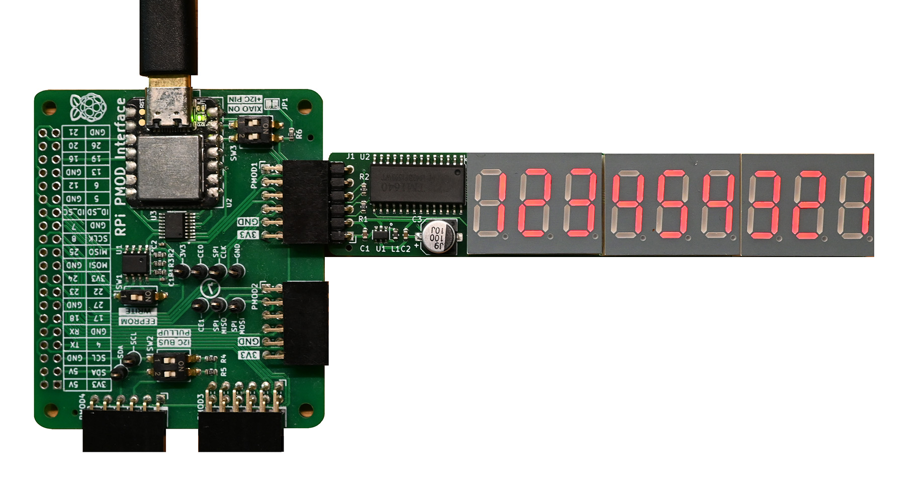

## Example code Pmod 7SEG9

The Arduino example program validates the function of the PMOD 7SEG9 module on the PMOD2RPI board, using the Seeedstudio XIAO MCU. It writes the numbers '123454321' to be displayed on the nine seven-segment digits. The PMOD 7SEG9 module is connected to PMOD1 lower pinrow.

The power draw for the PMOD tends to overload the XIAO MCU, and the PMOD2RPI board is best powered separately, e.g. through the Raspberry Pi header.

### Usage

 The PMOD 7SEG9 module running the demo sketch on the PMOD2RPI board.