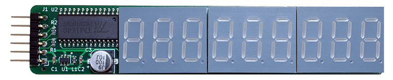
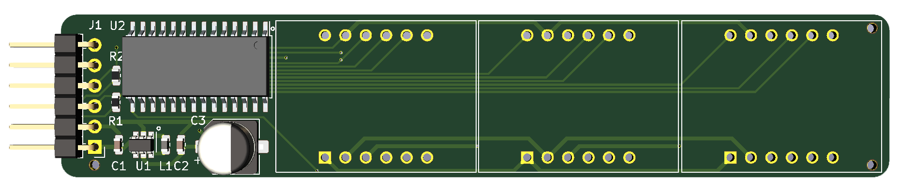
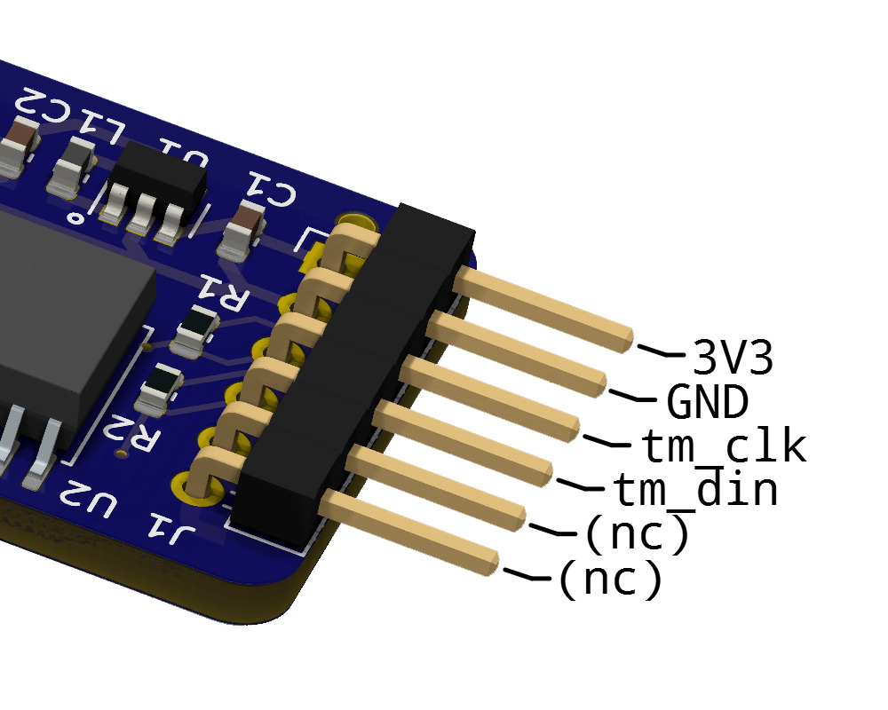
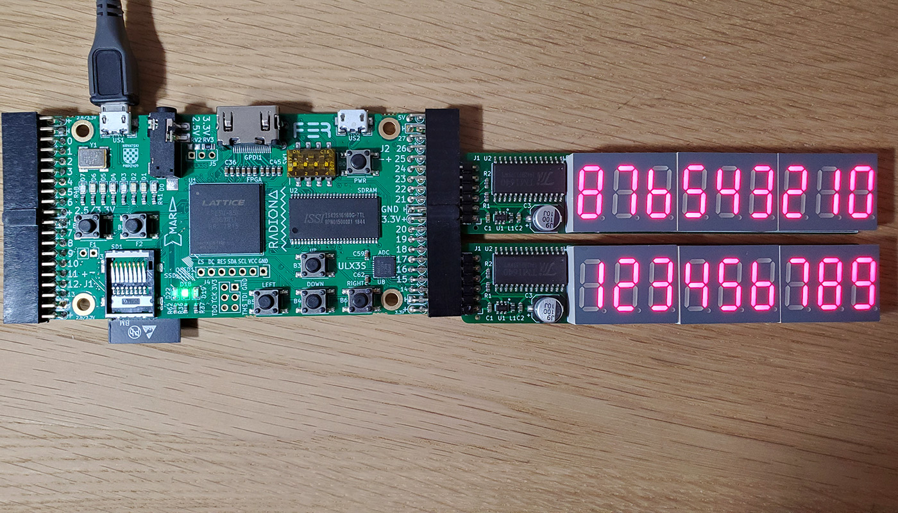
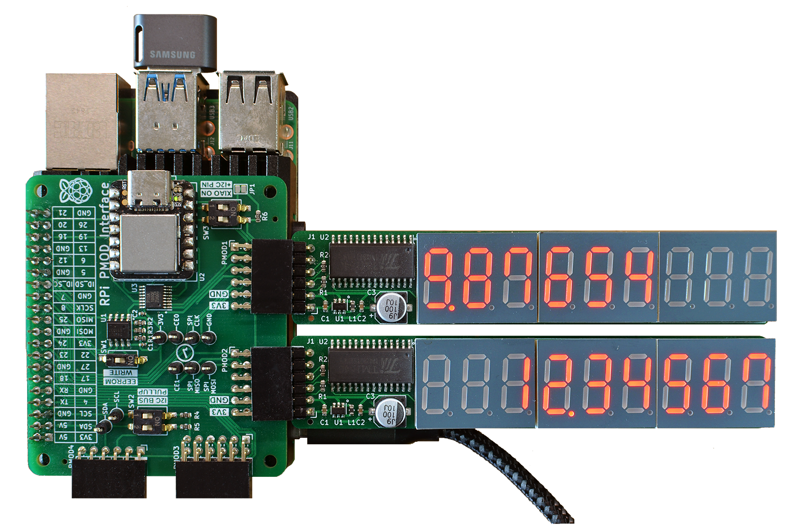

## 7SEG9 PMOD

### Description

This PMOD provides a 9-digit (3x3) 7-segment LED display output to FPGA designs via a single row PMOD connector. The LED segments are driven by the TM1640 LED driver IC from Titan Microelectronics. The TM1640 can only handle "common cathode" display types. It implements the required multiplexing, LED resistance and 8-level output power control that greatly reduces the passive components needed to drive LED displays. The TM1640 driver IC interfaces with application logic through a simplified two-wire serial protocol that has similarities with I2C. A small DCDC boost converter SGM6603 raises the 3.3V PMOD voltage to the 5V operating voltage needed by the TM1640 driver IC.

http://fpga.fm4dd.com/

*Note:* The 7SEG9 PMOD draws 220-250mA current over 9 digits. During power on/off, the peak current can reach 500mA. This needs attention for boards with weak power supply.

### Schematic

### PCB Gerber

[7SEG4 PMOD Gerber V1.2](fabfiles/v12/20200520-7seg9-gerber-v12.zip)

### Pin Assignments

<table>
  <tr><th>PMOD Pinout</th><th>Pin</th><th>Label</th><th>Function</th></tr>
  <tr><td rowspan="6"></td>
    <td>1</td><td>n/c</td><td>(not connected)</td></tr>
    <tr><td>2</td><td>n/c</td><td>(not connected)</td></tr>
    <tr><td>3</td><td>tm_din</td><td>LED control data</td></tr>
    <tr><td>4</td><td>tm_clk</td><td>Bus Clock (<1MHz)</td></tr>
    <tr><td>5</td><td>GND</td><td>PMOD Power</td></tr>
    <tr><td>6</td><td>3V3</td><td>PMOD Power</td></tr>
</table>

### Example Code

The following platform code examples demonstrate the board function for quick verification.

| Platform | Test Program location                | Description                                                  |
|----------|-----------------------------------------|--------------------------------------------------------------|
| Arduino IDE |[examples/arduino](examples/arduino) | Arduino IDE code (tested on PMOD2RPI Seeedstudio XIAO) |
| Raspberry Pi|[examples/pi-tm1640](examples/pi-tm1640) | Linux control program in 'C', using the libgpiod interface |
|IceBreaker|[examples/icebreaker](examples/icebreaker)| Verilog project for the IceBreaker FPGA (Lattice iCE40 FPGA family) |
| ULX3S    |[examples/ulx3s](examples/ulx3s)          | Verilog project for Radiona ULX3S FPGA (Lattice ECP5 FPGA family) |
| GateMate |[examples/gatemate](examples/gatemate)    | Verilog project for the Cologne Chip Gatemate E1 FPGA board |

### PMOD-7Seg9 Function Tests

The oscilloscope visualizes the protocol data transmission. Blue = data signal, Orange = clock signal.

7SEG9 PMOD connected to a Icebreaker v1.0 board, during protocol analysis

7SEG9 PMOD, connected to the Icebreaker FPGA board

Two 7seg9 PMODs, connected to a ULX3S (Lattice ECP5 85K) board

Two 7seg9 PMODs, connected to a Raspberry Pi via the PMOD2RPI interface board

