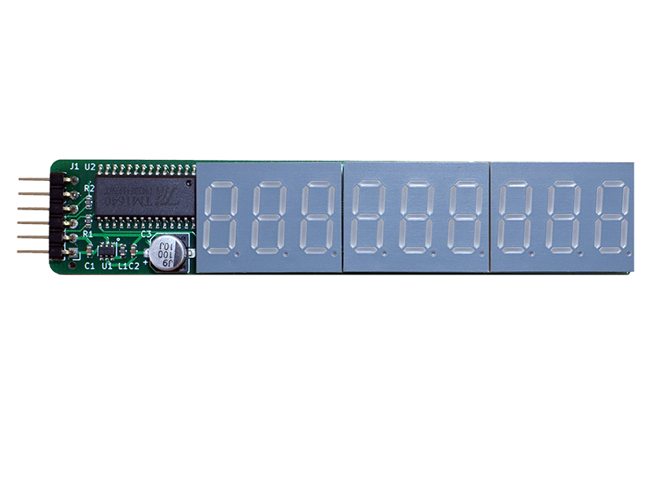
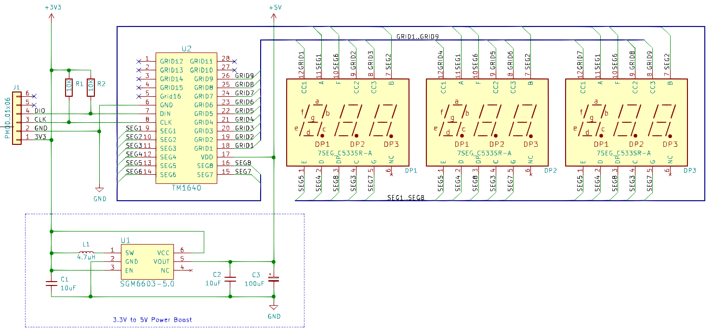
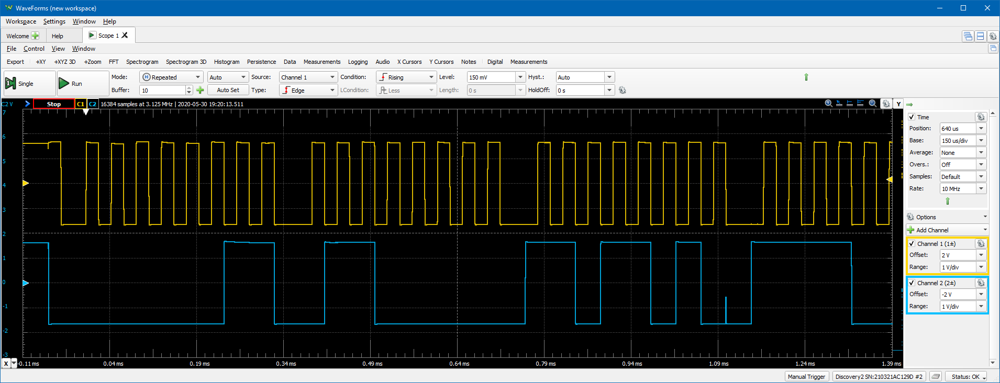
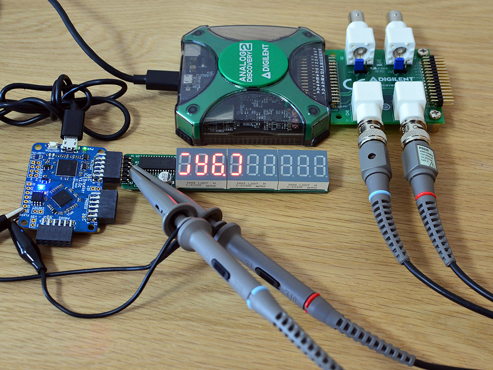
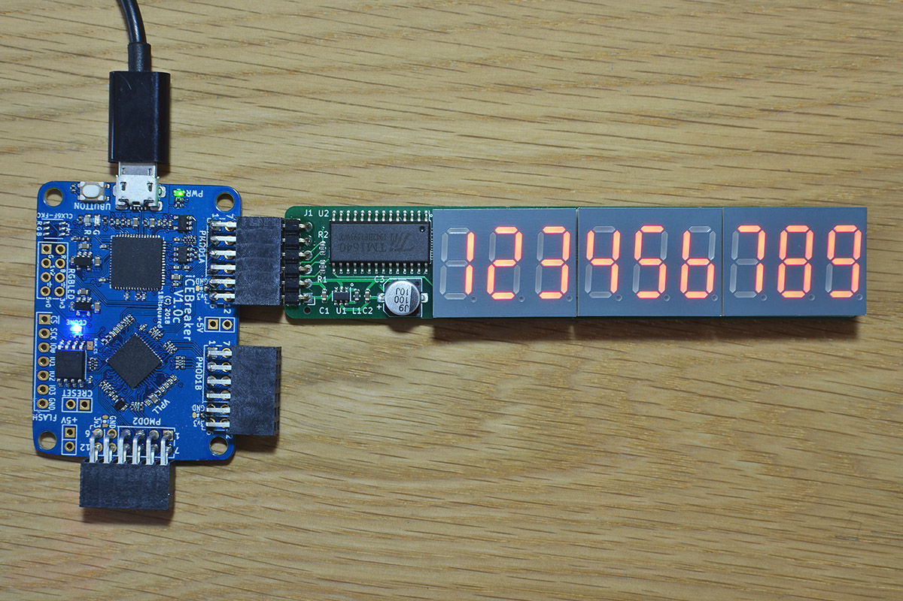

## 7SEG9 PMOD

### Description



This PMOD provides a 9-digit (3x3) 7-segment LED display output to FPGA designs via a single row PMOD connector.
The 7-segment display type is �common cathode�, and it is driven by a TM1640 LED controller IC. 
The TM1640 IC has its own simplified two-wire serial protocol with similarities to I2C.
While the controller IC has power control that eliminates the need for current limiting resistors, it requires 5V
power, which is provided by a small DCDC boost converter.

http://fpga.fm4dd.com/

### Schematic
[](images/7seg9-schema.png)

### PCB Gerber
[7SEG4 PMOD Gerber V1.2](20200520-7seg9-gerber-v12.zip)

### Pin Assignments

#### IceBreaker v1.0

 J21 |	Label |	Description   |	PMOD1A
-----|--------|---------------|-------
1    |	-     |	Not connected | 4
2    |	-     |	Not connected | 2
3    |	-     |	Not connected | 47
4    |  -     | Not connected | 45
7    |	-     |	Not connected | 3
8    |	-     |	Not connected | 48
9    | tm_clk |	Clock Signal  |	46
10   | tm_din |	Data Signal   |	44

 J22 |	Label |	Description   | PMOD1B
-----|--------|---------------|-------
1    |	-     |	Not connected | 43
2    |	-     |	Not connected | 38
3    |	-     |	Not connected | 34
4    |  -     | Not connected | 31
7    |	-     |	Not connected | 42
8    |	-     |	Not connected | 36
9    | tm_clk |	Clock Signal  | 32
10   | tm_din |	Data Signal   | 28

 J23 |	Label |	Description   | PMOD2
-----|--------|---------------|-------
1    |	-     |	Not connected | 26
2    |	-     |	Not connected | 23
3    |	-     |	Not connected | 20
4    |  -     | Not connected | 18
7    |	-     |	Not connected | 27
8    |	-     |	Not connected | 25
9    | tm_clk |	Clock Signal  | 21
10   | tm_din |	Data Signal   | 19

#### DE0-Nano-SoC

The connection to Intels DE0-Nano-SoC is made through the pmod2nano adapter.

DE0-Nano-SoC is still to bee tested.

### Protocol Example

[](images/pmod/7seg9-protocol-osc1.png)

The oscilloscope visualizes the protocol data transmission. Blue = data signal, Orange = clock signal.

[](images/pmod/7seg9-osc-setup.jpg) 

7SEG9 PMOD, connected to a Icebreaker v1.0 board, during protocol analysis

### Example Code

[](images/7seg9-icebreaker.jpg)

7seg9 PMOD, running test program pmod_7seg4_1.v
#### Verilog

Verilog test program pmod_7seg4_1.v (top-level):
```
// -------------------------------------------------------
// This program turns on the display and shows "123456789"
//
// Adopted for TM1640 IC protocol from the TM1637 verilog
// example at https://github.com/alangarf/tm1637-verilog.
// -------------------------------------------------------
module pmod_9seg9_1(
  input clk,
  output tm_clk,
  output tm_din
);

reg rst = 1;
reg [18:0] counter;
reg [7:0] instruction_step;
reg tm_latch;
reg [7:0] tm_byte;
reg tm_end;
reg tm_busy;

tm1640 disp ( clk, rst, tm_latch, tm_byte, tm_end,
              tm_busy, tm_clk, tm_din );

always @(posedge clk) begin
  if (rst) begin   // rst runs only once at start time
    counter <= 0;
    instruction_step <= 0;
    tm_latch <= 0;
    tm_byte <= 0;
    tm_end <= 0;
    rst <= 0;
  end
  else begin       // start sending the list of instructions
    if (tm_busy == 0 && instruction_step < 13) begin
      case (instruction_step)
        1: begin
          // -------------------------------------------------
          // Command1 | 0 | 1 | x | x | N | I | x | x | DATA
          // N = Normal (0), I = Addr incr (0), x = N/A (0)
          // -------------------------------------------------
          tm_byte <= 8'b01000010;
          tm_end <= 1;
          tm_latch <= 1;
        end
        2: begin
          // -------------------------------------------------
          // Command2 | 1 | 1 | x | x | D | C | B | A | ADDR
          // A,B,C,D =  LED adddress in bin (range 0x0..0xF)
          // -------------------------------------------------
          tm_byte <= 8'b11000000;
          tm_end <= 0;
          tm_latch <= 1;
        end
        3: begin
          // -------------------------------------------------
          // Data1, write '1'
          // -------------------------------------------------
          tm_byte <= 8'b00000110;
          tm_end <= 0;
          tm_latch <= 1;
        end
        4: begin
          // -------------------------------------------------
          // Data2, write '2'
          // -------------------------------------------------
          tm_byte <= 8'b01011011;
          tm_end <= 0;
          tm_latch <= 1;
        end
        5: begin
          // -------------------------------------------------
          // Data3, write '3'
          // -------------------------------------------------
          tm_byte <= 8'b01001111;
          tm_end <= 0;
          tm_latch <= 1;
        end
        6: begin
          // -------------------------------------------------
          // Data4, write '4'
          // -------------------------------------------------
          tm_byte <= 8'b01100110;
          tm_end <= 0;
          tm_latch <= 1;
        end
        7: begin
          // -------------------------------------------------
          // Data5, write '5'
          // -------------------------------------------------
          tm_byte <= 8'b01101101;
          tm_end <= 0;
          tm_latch <= 1;
        end
        8: begin
          // -------------------------------------------------
          // Data6, write '6'
          // -------------------------------------------------
          tm_byte <= 8'b01111100;
          tm_end <= 0;
          tm_latch <= 1;
        end
        9: begin
          // -------------------------------------------------
          // Data7, write '7'
          // -------------------------------------------------
          tm_byte <= 8'b00000111;
          tm_end <= 0;
          tm_latch <= 1;
        end
        10: begin
          // -------------------------------------------------
          // Data8, write '8'
          // -------------------------------------------------
          tm_byte <= 8'b01111111;
          tm_end <= 0;
          tm_latch <= 1;
        end
        11: begin
          // -------------------------------------------------
          // Data9, write '9'
          // -------------------------------------------------
          tm_byte <= 8'b01101111;
          tm_end <= 1;
          tm_latch <= 1;
        end
        12: begin
          // -------------------------------------------------
          // Command3 | 1 | 0 | x | x | D | U | M | L | CTRL
          // D = Display on/off, U = upper brightness bit,
          // M = mid brightness bit, L = low brightness bit
          // -------------------------------------------------
          tm_byte <= 8'b10001111;
          tm_end <= 1;
          tm_latch <= 1;
        end
      endcase
                    
      instruction_step <= instruction_step + 1;
    end
    else if (tm_busy == 1) begin
      tm_latch <= 0;
    end
  end
end
endmodule
```
#### VHDL

TBD
